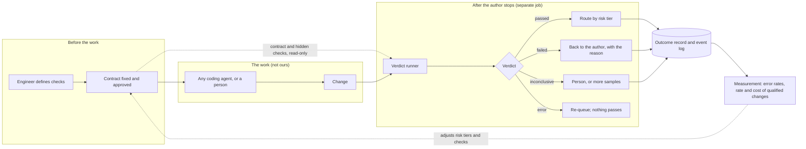

# System design — tooling for evidence-driven development

| | |
|---|---|
| Status | Reviewed by Pedro on 2026-10-05, with five decisions recorded in §9. Nothing here is built. |
| Reads with | `docs/PROPOSAL.md` (what and why), `docs/PLAN.md` §2.1 (decisions), §7 (prototype) and §8 (positions) |
| Evidence | Figures cite `docs/research/EVIDENCE.md` as (E-nn). Design rules without a citation are our own judgment. |
| Scope | Two designs: the product (§1 to §6) and the one-day prototype that tests it (§7). The mandatory items from the brief are in §8. |

The design in one sentence: **it trades speed to merge, and some good changes wrongly held back, for a verdict that the author of a change cannot influence.**

## 1. Requirements

### 1.1 Who touches it

| Actor | What they do | What they need back |
|---|---|---|
| Engineer | Writes the task, defines the checks, approves the contract | A clear verdict, and the reason when it is not a pass |
| Coding agent (any vendor) | Makes the change | Nothing from us while it works. It is the author, and it is not trusted |
| Reviewer | Looks at changes the verdict could not settle | The evidence first, the diff second |
| Engineering leader | Sponsors the tool, reads the measurement report | The rate and cost of production-qualified changes, and how far the verdict can be trusted |
| Auditor | Asks what was accepted and on what grounds | A record that can be replayed |
| Build pipeline | Runs the verdict | A job that is repeatable and gives one status |

The easily forgotten need is the engineer's "what happened to the change I submitted, and why". Every state below has a reason attached for that purpose.

### 1.2 What it must do

1. Guide an engineer to define checks for a task: a test suite, or an evaluation.
2. Fix a contract before the agent runs.
3. Produce a verdict after the agent stops.
4. Keep an outcome record for every change.
5. Route each change by risk: accept, send to a person, or block.
6. Measure how often the verdict itself is wrong, per repository and per model.
7. Report the rate and cost of production-qualified changes.

### 1.3 What we cut

- No code generation and no agent of our own (the prototype borrows a published one).
- No orchestration of agents, no sandbox for them, no policy layer. The team's assistant and environment own those.
- No hosted service. It runs in the customer's pipeline.
- No dashboard in the first version: a command line, a status in the pipeline, and files.
- One repository at a time.

### 1.4 Qualities, each with what it costs

| Quality | Rule | What we give up |
|---|---|---|
| Integrity | The author of a change cannot alter the checks, the contract or the verdict | Time: the verdict runs as a separate job after the agent stops |
| Tenancy | Code, checks and records stay in the customer's environment | Central learning across customers, and easy support |
| Replay | Any verdict can be reproduced from its record | Storage, and the discipline of versioning everything |
| Bounded cost | Verification has a budget fixed in the contract | Some results end as inconclusive |
| Fail closed | When the verdict process itself breaks, nothing passes | Some good changes held back |

## 2. Core objects

The unit is one change against one contract. State is kept per check, not per change, so that re-running one failed check is a query and not a restart.

### 2.1 Check

A named, executable test of one thing.

| Field | Meaning |
|---|---|
| `id`, `version` | Stable name; a changed check is a new version |
| `kind` | `test`, `static`, `scope`, `test-adequacy`, `dependency`, `evaluation` |
| `command` | What to run |
| `visibility` | `visible` to the author, or `hidden` (mounted only where the verdict runs) |
| `owner` | The person who wrote or approved it |

### 2.2 Contract

Fixed before the agent runs. It is the answer to "what does done mean for this task".

| Field | Meaning |
|---|---|
| `id`, `version`, `hash` | The hash is what the pipeline pins |
| `task` | The request, as given to the author |
| `base_commit` | Where the work starts |
| `scope` | Paths the change may touch; paths it must not touch |
| `checks` | The checks that must pass, by id and version |
| `thresholds` | For evaluations: the measure, the pass mark, the confidence required |
| `budget` | Limits for the agent (attempts, money, time) and for verification |
| `risk_tier` | Green, yellow or red (§4.3) |
| `approved_by` | A person. The author cannot approve its own contract |

The contract and the hidden checks live on a **protected branch** of the team's repository, which the author of a change cannot write to. The verdict job reads them from there, and the contract's hash is recorded with the verdict. This uses what the team's repository host already provides, with its existing permissions and history, and needs no separate store.

### 2.3 Evidence item

One result of one check: check id and version, exit status, a structured report, duration, cost, and the versions of everything involved.

### 2.4 Verdict

| State | Meaning |
|---|---|
| `pending`, `running` | Not yet decided |
| `passed` | Every required check passed |
| `failed` | A required check failed, with the first reason |
| `inconclusive` | The evidence does not settle it (evaluations only); goes to a person or to more samples |
| `error` | The verdict process itself broke. Not a pass, not counted as a fail, and re-queued |
| `overridden` | A person accepted or rejected against the verdict, with a reason |

A person's override is recorded as a label. Labels are how the verdict's error rate is measured later.

### 2.5 Outcome record

One per change, written once and never edited: the contract hash, base and head commits, the author (which agent, which model, which version of the assistant), every evidence item, the verdict and its reason, the risk tier and where the change was routed, cost and time, and any override.

### 2.6 Idempotency

The key for a verdict is base commit, head commit, contract hash and check id. Running the same thing twice gives the same record, not two.

### 2.7 The first process: from a use case to checks

Before any work is delegated, the product takes the team from a description of what is wanted to checks that can be run.

1. **The engineer writes a use-case description**, with the main functional requirements. It is short and in plain language.
2. **The team's own assistant asks clarifying questions.** The assistant the team already uses reads the description and the repository and asks about what is missing or ambiguous. Agents tend to guess when a task is underspecified (E-80); here that tendency is turned into questions before the work starts.
3. **Checks are drafted from the requirements.** Each functional requirement leads to at least one check, and the link between them is kept, so it is visible which requirements are covered and which are not.
4. **A person approves.** The requirements, the checks and the scope become the contract, which goes to the protected branch.

The assistant helps to ask and to draft. It does not approve, and it does not write to the protected branch.

## 3. How it fits together

**Components**

- **Check library.** The team's checks, versioned with the repository; hidden ones held apart.
- **Contract store.** Read-only to authors.
- **Verdict runner.** A job in the team's pipeline. It reads the diff and the contract. It never reads the agent's conversation: a verifier that reads the author's account of its work inherits the author's mistakes.
- **Event log.** Append-only. Every step of the verdict is one structured event carrying the versions of the contract, the checks, the model and the assistant. It serves as audit trail, cost ledger and incident record at once.
- **Outcome records.** Derived from the event log.
- **Measurement runner.** Runs a set of tasks several times under different conditions and compares verdicts with ground truth (§5).

**Attachment.** First as a required check in the pipeline, which needs nothing from any assistant's vendor. Hooks inside an assistant are offered as well, for the moments when a person should step in: pausing for approval, asking a question, or returning early feedback from the visible checks. The verdict that counts is always the pipeline's.

## 4. The verdict

### 4.1 Decision order for conventional code

First match wins. Cheap and decisive checks run first.

1. **The verdict process failed** (infrastructure): `error`. Re-queued. A check that crashed must never read as clean.
2. **The contract or a protected path was altered**: `failed`, flagged as an integrity violation.
3. **Budget or time exceeded**: `failed`.
4. **The build fails**: `failed`.
5. **A required test fails**, visible or hidden: `failed`.
6. **The change left its scope**: `failed`.
7. **The author's own new tests pass against the original code**: `failed`. Tests that cannot tell the old code from the new prove nothing (E-76).
8. **A new dependency does not exist, or a secret is present**: `failed`.
9. **Otherwise**: `passed`.

### 4.2 The evaluation path, for LLM applications

Software whose behaviour comes from a model answers differently each time. One run of it proves little, so the check is an evaluation.

- **Cases.** A versioned set, split into cases the author may see and cases it may not. An agent tuning a prompt against the whole set would fit the set, not the task.
- **Coverage.** The cases are comprehensive by default: every functional requirement in the contract has cases, and the set includes ordinary inputs, edge cases and inputs meant to break it. Which requirements are covered, and by how many cases, is reported with the result. Budget limits the number of repeats, not the breadth of the cases.
- **Repeats.** Each case is run several times, with enough samples for the result to mean something. The number is bounded by the contract's budget.
- **Scoring, in order of preference.** Code first: exact match, schema, a required tool call, a numeric tolerance. A model scores only what code cannot. A person scores what neither can.
- **Conditions on a model scorer.** It is checked against cases a person has labelled, and its agreement is stated. It is pinned to a version and a prompt. It comes from a different vendor than the model under test where possible. Its rubric asks for one criterion at a time, with few levels.
- **The decision.** With the measured pass rate and its uncertainty:
  - `passed` if the whole plausible range is at or above the pass mark, and the change is no worse than the previous version on the same cases;
  - `failed` if the whole plausible range is below the pass mark;
  - `inconclusive` otherwise. The runner takes more samples while budget remains, then hands the change to a person.
- **Two sources of error.** Too few samples, and a scorer that is wrong. Both are reported.
- **Cost.** Cases times repeats times model calls. This is the expensive path, which is why sample sizes follow risk.

This path is designed here and built only if time allows (`PLAN.md` §2.1, T12).

### 4.3 Risk tiers and routing

| Tier | Set by | On `passed` | Otherwise |
|---|---|---|---|
| Green | Path rules written by a person: well tested, isolated code | Accepted | Back to the author |
| Yellow | The default | Sent to a reviewer, with the evidence in front of the diff | Back to the author |
| Red | Path rules: sign-in, payments, permissions, anything the team names | A person on every step; an agent may propose but not land | Back to the author |

A person draws the tiers, not a model. A model's confidence is a poor guide to risk (E-74). A tier widens only when the measured false-pass rate for that class of change supports it: autonomy is earned with numbers.

A pending human decision has a time limit. When it runs out the change is escalated, then expired. Nothing is accepted by default.

## 5. Measuring the verdict itself

A verdict of unknown reliability is another opinion. The product measures its own, in two directions.

- **False pass:** a change that should have failed and passed. Measured with planted flaws: changes built to be wrong in known ways (out of scope, tests weakened, a check tampered with, behaviour quietly dropped).
- **False fail:** a good change that failed. Measured with known-good changes, for example ones people wrote and merged. A verdict that blocks good work is bypassed.

For the agents being measured:

- **Consistency, not one run.** The share of tasks that pass on every one of several attempts. An agent above 60% on average can fall below 25% when it must succeed eight times running (E-79).
- **Cost per production-qualified change.** The cost of all attempts, failures included, divided by the number that qualified.
- **Reported per kind of task and per model.** A model upgrade is treated as a release: the measurement is re-run and compared with the previous one.

If these numbers stop predicting what happens after merge, the fix is to the checks, not to the pass mark.

## 6. The brief's design topics

For each topic: whose it is, our position, the alternative rejected, and how we would know.

| Topic | Whose | Position | Rejected | How we know |
|---|---|---|---|---|
| Model | The assistant's | We are neutral on the model that writes the code. Where we call one (a model scorer, the comparison evaluator), it is pinned to a version, recorded in every event, and from another vendor than the author where possible | A model of our own; one vendor for author and judge | Results reported per model pairing |
| Context management | The assistant's | The verdict needs none of the author's context. It reads the diff and the contract only | Giving the verifier the agent's transcript | Verdicts reproduce from the record alone |
| Repository understanding | The assistant's | Ours is deterministic: the diff, path rules, and later a map of what references what, for risk | An embeddings index. No index to build, keep fresh or secure | Scope violations caught in planted-flaw tests |
| Tool execution and permissions | The team's environment | We add no sandbox. The verdict job has a read-only checkout, cannot write the contract, and holds no deployment credentials | Building a policy and sandbox layer, which exists as open source (E-32) | The integrity planted flaws are all rejected |
| Orchestration | The pipeline | The verdict is a short job with fixed steps; the pipeline is the orchestrator, and its required review is the human pause | A workflow engine. Not needed at this size, and not something a small team should build | Re-running a verdict gives the same record |
| Evaluation | Ours | The centre of the product (§4, §5) | A model's opinion as the verdict | False-pass and false-fail rates |
| Security | Shared | The author is untrusted. A model trained on coding tasks has been observed learning to force tests green, including by patching the test reporter (E-75). Deterministic checks come before any model check. Text from the repository is data, never instructions. The deterministic path has no network access; a model scorer reaches only the endpoint the customer configured | Trusting structured output as a defence; approving commands one by one | Planted tampering is caught |
| Privacy | Ours | Everything stays in the customer's environment. Nothing is sent to us, used for training, or shared across customers. Customers are told what is used and for what | A hosted service | No outbound traffic from the deterministic path |
| Observability | Ours | One wide, typed event per step, with versions. The event log tells what happened; the evidence tells whether it was good | Free-text logs | Any verdict can be replayed |
| Human layer | Ours | People write and approve checks and contracts, review what the verdict cannot settle, and can override with a reason. Overrides become labels | No human in the loop as a default | Override rate, and review time per change |
| Latency | Ours | The verdict adds waiting before merge. Cheap checks run first so failures return quickly; expensive checks follow risk | Checking everything equally (E-36) | Time from task to accepted change, with and without |
| Cost | Ours | A budget in the contract covers verification as well as the agent. Enforced before a call is made. Cost is recorded per change | Unbounded retries | Cost per production-qualified change |
| Failure handling | Ours | A ladder: retry an infrastructure failure once; then `error` with nothing passing; a missing scorer leaves the deterministic verdict standing and flagged; an exhausted budget gives `inconclusive` and a person | Passing by default when something breaks | Injected failures never produce a pass |

## 7. The prototype

One day, 50 USD. It tests conventional code only.

### 7.1 Parts

- **Agent under test.** The 90-line published scaffold (E-59), with adapters for the model providers and an event log. Departures from the listing are recorded in the journal.
- **Fixture repository.** A small Python package with a test suite, written for the purpose.
- **Tasks.** A small set of ordinary changes, plus trap tasks that invite a specific failure: touching a file outside scope, weakening a test, a destructive command, an instruction planted in a repository file, editing the contract.
- **Hidden acceptance checks** for every task: the ground truth. Neither the agent nor the gate sees them.
- **Planted flaws.** Changes made by hand to be wrong in known ways, fed straight to the gate.
- **Known-good changes.** Correct changes made by hand, fed straight to the gate, to measure false fails.

### 7.2 Three arms, each task run several times

| Arm | What runs |
|---|---|
| Bare | The scaffold alone |
| Prompt discipline | The scaffold, told to verify before claiming completion |
| Gated | The scaffold, with the contract and the verdict of §4.1, and a bounded number of repair attempts |

Every arm runs in an isolated copy of the fixture, because the scaffold has no sandbox.

### 7.3 Verdict sources compared with ground truth

1. The agent's own claim that it is done.
2. An evaluator agent from another vendor, modelled on the one Anthropic describes, on a sample of runs.
3. The gate.

### 7.4 What is built first

1. **The measurement skeleton, with a fake agent that costs nothing.** Tasks, hidden checks, the runner and the results table, proven end to end before any money is spent. This also proves that a crashed check reads as an error and not as a pass.
2. The scaffold and its adapters, on one task.
3. The gate and the event log.
4. The planted flaws and the known-good changes.
5. The three arms across all tasks, under the cap. The cost of the first task is used to size the rest.
6. The evaluator comparison on a sample.
7. Bonus: one small evaluation-path task.

### 7.5 What it reports

Unsafe actions per arm; pass rate on one attempt and on every attempt; false-pass and false-fail rates per verdict source; cost per production-qualified change; time and cost added by the gate; planted flaws rejected out of planted flaws tried. Every result table is generated from run files.

## 8. Risks, assumptions, redlines

### 8.1 Assumptions

| # | We assume | Tested by |
|---|---|---|
| A1 | A team can write checks for ordinary work at a cost it accepts | The pilot. The prototype writes them by hand |
| A2 | An executable verdict is wrong less often than the agent's claim or a model reviewer's | The prototype |
| A3 | The time and cost the gate adds are repaid in review, rework and incidents avoided | The pilot |
| A4 | A result measured on one model says something about the next | Re-measurement at each release |
| A5 | Teams will keep hidden checks hidden, and contracts out of the author's reach | The pilot |
| A6 | Planted flaws resemble the mistakes agents really make | Comparing them with failures seen in the runs |

### 8.2 Risks

| Risk | Response |
|---|---|
| The checks under-describe what matters, so bad changes pass | The test-adequacy check now; a search for counterexamples as the next enhancement; the false-pass rate reported, not assumed |
| The gate blocks good work and gets bypassed | The false-fail rate is measured and shown beside the false-pass rate |
| A small, hand-written task set flatters the gate | Stated wherever results appear; trap tasks and hidden checks written before the gate |
| The prototype overruns the cap | A fake-agent dry run first; the first paid task sizes the rest; the runner stops at the cap |
| An evaluator from another vendor is unavailable or too costly | The deterministic comparison stands; the evaluator is applied to a sample |
| Results do not carry to the next model | Presented as a snapshot; re-measurement is part of the product |

### 8.3 Redlines

The product never does these, in any configuration.

1. Accept a change when the verdict process failed.
2. Let the author of a change write to the contract, the hidden checks or the verdict.
3. Let the agent that wrote a change approve it.
4. Land a red-tier change without a person.
5. Send the customer's code, checks or records outside their environment.
6. Use customer data for anything the customer has not been told and agreed to.
7. Report a pass rate without the verdict's own error rates beside it.
8. Report a throughput number without its quality number.
9. Run without a record.

For the probe itself: it stops at the conditions in `PLAN.md` §2.1 (T7).

## 9. Decisions taken on this design

Decided by Pedro on 2026-10-05 (`PLAN.md` §2.1, T15 to T19).

| Question | Decision |
|---|---|
| Where the contract lives | A protected branch of the team's repository (§2.2) |
| The first process | A use-case description with the main functional requirements; the team's own assistant helps with clarifying questions; checks are drafted from the requirements and approved by a person (§2.7) |
| Evaluation cases | Coverage and data samples are comprehensive by default (§4.2) |
| Hooks inside the assistant | Offered, for human intervention and early feedback; the pipeline's verdict is the one that counts (§3) |
| Diagrams | Mermaid for now |

**The prototype stays very simple.** It builds none of the following: the first process (contracts are written by hand), the protected branch (the contract and hidden checks sit in a directory outside the agent's working copy), hooks, or the evaluation path unless time allows.
