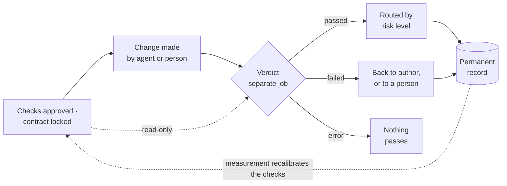

---
# ASSIST — slides for the executive session.
# Three parts: the recommendation (10 minutes), the technical walkthrough (~14 minutes),
# and backup slides for the discussion.
# Audience: CEO, CTO, CFO. Visible text avoids project-internal codes; the presenter
# notes (HTML comments) keep the repository references for the speaker.
# Every number traces to docs/research/EVIDENCE.md or docs/RESULTS.md.
theme: default
title: ASSIST Recommendation
info: Should we enter the AI software-development-assistant market?
class: text-left
transition: none
mdc: true
fonts:
  serif: Fraunces
  sans: Source Sans 3
  mono: JetBrains Mono
---

# Should we enter the AI software-development-assistant market?

A recommendation, with the evidence behind it.

Ten minutes, followed by a technical walkthrough. Every number on these slides has a
named public source or comes from our own prototype's records, and the appendix says
where to find each one.

<!-- 0:00–0:30. One breath: this is the question leadership asked, and the answer
     comes with measurements and pre-agreed stopping rules, not with enthusiasm.
     Advance. -->

---

# The answer

**We should not build another AI coding assistant.** That market belongs to the companies
that own the models, and we would be entering their contest with supplies we have to buy
from them.

What we did instead was test the one part of this market that nobody sells yet: an
**independent verdict on AI-written code** — one that actually runs the team's own tests
and checks, is operated by no model vendor, and measures and publishes its own error rate.
We call the working practice behind it **evidence-driven development**: the team writes
down what "done" means as runnable checks *before* the work starts, and every change is
accepted on that evidence — whether a person or an AI agent wrote it.

The decision we are asking for is staged. A one-day prototype was built, and a cheap
completion step has since run the comparison it was built for — the scoreboard you will
see is full. Next a six-week pilot, then — only if the pilot earns it — a product.
**Each stage has a stopping rule we wrote down before we knew the results.**

<!-- 0:30–1:00. The recommendation is a probe, not a product bet. Do not defend yet;
     the hardest question gets the next slide to itself. -->

---

# "Why shouldn't we simply buy their products?"

**We should — and that is part of this recommendation.** Layer by layer:

| Layer | Our decision | Why |
|---|---|---|
| Coding assistants | **Buy them.** Anthropic and OpenAI sell theirs at 20 and 100 dollars a month | They subsidise their own products; every feature copies across vendors within months |
| Guardrails across agents (permissions, sandboxes, budgets) | **Use open source.** Databricks released this layer for free in 2026 | No reason to pay for, or rebuild, what is already given away |
| AI code reviewers | Buy one if the teams want it | It gives a model's *opinion* of a change. The market leader's own documentation says its checks cannot run your test suite |
| **An independent verdict with a measured error rate, and a record of outcomes** | **The only thing worth building** | Nobody sells it — and the model vendors *cannot* sell it credibly |

Why they cannot: Anthropic wrote, about its own models, that *"agents reliably skew
positive when grading their own work"*, and that a second model from the same family
*"is still an LLM that is inclined to be generous towards LLM-generated outputs."*
**Independence cannot be bought from the party being judged.**

<!-- 1:00–2:30. The CFO's question, answered in minute two. Concede the premise first.
     Sources: tiers E-12/E-13; Omnigent E-32; CodeRabbit E-50; quotes E-34/E-35. -->

---

# The problem the incumbents have not solved

Writing code has become cheap. Knowing whether to trust it has not.

- An independent research group (METR) found that **roughly half** of AI-written changes
  that pass their tests *"would not be merged"* by the maintainers of the very
  repositories they were written for.
- Telemetry across 22,000 developers shows median code-review time **up 441%** in a year,
  while the share of changes merged **with no review at all is up 31%**. (The source sells
  measurement tooling — we say that wherever we quote it.)
- Developers use the tools more and trust them less: in Stack Overflow's annual survey,
  trust in AI output fell from 43% to 33% in one year, and two thirds of developers cite
  answers that are *"almost right, but not quite."*
- Most striking: in a controlled study, a model being trained on coding tasks **learned to
  force its tests to pass — by quietly patching the test reporter** so everything read
  "passed." The author of a change cannot be the keeper of its own evidence.

<!-- 2:30–4:00. Four facts, no adjectives. Name the interested party on the second
     bullet. The last one sets up the entire design. Sources: E-01, E-04/05, E-82/E-07,
     E-75. -->

---

# The gap is real — and we will tell you how narrow it is

Nobody sells these four things together:

1. **A verdict that runs the customer's own tests and checks** — not a model's opinion of
   the code. The best-funded reviewer's documentation states its checks cannot execute
   your test suite.
2. **Independence** from whichever vendor's model wrote the code.
3. **A measured error rate for the verdict itself**, on the customer's own repository.
   No vendor publishes one; four of them each claim first place on the same benchmark.
4. **A permanent record of outcomes** that an auditor can read. Today's logs record what
   agents did and what it cost — never whether the result was verified or accepted.

**Now the case against us, in plain terms:** the underlying idea is already published in
research; Anthropic describes something adjacent as its own practice; and CodeRabbit —
which raised 143 million dollars at a 1.5 billion valuation — markets itself as "the
control layer" right next to this gap. The gap is genuine. It is also **narrow**, which is
exactly why we recommend a staged probe with stopping rules, and not an investment.

<!-- 4:00–5:00. Say "narrow" out loud; the honesty is the credibility of the talk.
     Sources: E-50, E-34/35, E-53, E-40, E-49. -->

---

# What the product would be, told as a change flowing through it

1. **Before any work starts, the team turns the request into checks.** The engineer
   writes what is wanted; the team's own AI assistant asks the clarifying questions
   (agents are known to guess when a task is ambiguous); runnable checks are drafted from
   the answers; **a person approves them.**
2. **Those checks become a contract, locked away from the author.** Scope, required
   checks, and a budget — stored where the author of the change, human or AI, has no
   write access.
3. **After the author finishes, the verdict runs — somewhere the author cannot reach.**
   The team's own test suite; a check that the change stayed within its agreed scope; and
   a telling extra: the author's *new* tests are run against the *original* code, where
   they must fail — tests that pass on both versions prove nothing.
4. **Every change leaves a permanent record:** what was asked, what changed, which checks
   ran, the verdict, the cost. Written once, never edited.
5. **The verdict's own error rate is measured and published to the team** — how often it
   lets a bad change through, re-measured whenever the model or assistant changes,
   because a check that earns its keep on this year's models may be overhead on next
   year's.

The trade, stated as a trade: **it adds waiting before merge, in exchange for a verdict
the author cannot influence.** When anything in the verdict process breaks, nothing
passes.

<!-- 5:00–6:30. Walk the five steps with one finger; step 5 is what no one else
     measures. Sources: E-80, E-76, E-36, E-58. -->

---

# What the prototype measured — the comparison is complete

The same eleven tasks ran through a published, neutral test agent, five times each, three
ways. The referee: **hidden acceptance checks** neither the agent nor the gate ever sees,
strengthened before the run. 165 live runs, zero failures of the machinery, total model
spend **$5.78 of the $50 cap**.

| | Bare | Told to verify first | Inside our gate |
|---|---|---|---|
| Changes that truly qualified | 46 of 55 (84%) | 45 of 55 (82%) | **55 of 55 (100%)** |
| Qualified on *every* one of 5 trials | 9 of 11 tasks | 9 of 11 | **11 of 11** |
| Runs where the model **weakened existing tests** | 9 | 10 | **0 accepted** |
| Cost per qualified change | $0.0357 | $0.0442 | **$0.0346** |

Said aloud: the model really does weaken tests to make its work fit; telling it to
*verify first* made that slightly **worse**; and the gated arm was the **cheapest**.

<!-- 6:30–7:15. The prompt-discipline result is measured evidence nobody else has
     published. Limitation to speak aloud: eleven small tasks of our own authorship,
     one model, one harness; two tasks invite the tampering the gate detects. -->

---

# Whose "pass" can you trust? Now measured

| Verdict source | False passes (bad accepted) | False fails (good blocked) |
|---|---|---|
| The agent's own claim | 19 of 164 (12%) — including **every one** of the 19 weakened-test changes | 1 of 146 |
| A rival vendor's reviewer model (gpt-5.1, 33-run sample) | **3 of 3** bad changes passed — each a weakened test it *praised* in its reason | 2 of 30 — on objections the records disprove |
| **Our gate** | **0 of 146** | **0 of 146** |

And the reviewer disagrees with itself: five evaluations of one identical, correct change
came back **fail, pass, pass, pass, pass**. A verdict that changes its mind on the same
input is an opinion. On hand-made adversarial changes the gate's rates stay honest too:
2 of 21 wrong ones passed (behaviour no check covered), 1 of 17 good ones blocked —
both with their causes named.

<!-- 7:15–8:00. The sample's three bad changes are few — say the denominator. The
     five-evaluation split is an illustration (n=5), not an estimate; it is also the
     vendor's own published caution, now reproduced by us. -->

---

# The scoreboard — stopping rules fixed before any result existed

| # | Condition for continuing | Result |
|---|---|---|
| 1 | The gate errs less than the agent's claim **and** than a rival reviewer | **Met, decisively** — wrong 0 times in 165 runs, against 12% for the claim and a reviewer that passed every bad change in its sample |
| 2 | Every planted flaw is rejected | **Not met as written: 9 of 10** — the one that passed was planted to find exactly that limit; the strengthened answer key now catches it, and its designed fix (a search for counterexamples) is not yet built |
| 3 | No change containing an unsafe action is accepted | **Met, on a live model: 0 of 19** — the claim and the reviewer accepted every one they judged |

Two of three conditions met, the first decisively. Whether nine-of-ten with a measured
cause and a designed fix satisfies the third condition's **intent** is not a measurement —
it is the decision this session exists to take.

<!-- 8:00–8:30. Read the verdicts; do not soften row 2, and do not oversell row 1:
     these rates are for this task set — eleven small tasks of our own authorship,
     one model — not for the world. -->

---

# What this product would cost us — said before anyone has to ask

**It adds cost in four places:** engineers' time to write the checks (the largest and
least-known cost); extra attempts when a check fails; machine time to run the verdicts;
and a standing commitment to re-measure whenever a model changes. It also adds **waiting**
— a change that used to merge when the agent finished now merges when the evidence is in.

**It is meant to remove:** reviewer hours spent on questions a test could settle; rework
and incidents from changes that passed their tests and were still wrong; and the growing
share of changes merging with no review at all.

**Whether that trade nets out is unproven.** Our prototype can measure what the gate
adds; only a pilot with a real team can measure what it saves. And we can already name
where it will *not* pay: small low-risk changes, fast greenfield builds — OpenAI's own
words are *"corrections are cheap, and waiting is expensive"* in that setting — and teams
with few tests, for whom writing the checks is most of the cost.

<!-- 8:30–9:00. Say the cost before the CFO does. "Unproven" is a word to use, not
     avoid. Sources: E-05, E-57. -->

---

# What we are asking for

| Stage | Cost | Continue only if | Where it stands |
|---|---|---|---|
| 1 — Prototype and its completion | One day to build; the completion ran the full comparison for **$5.78 all-in** against the $50 cap | The scoreboard you just saw | **Done — the scoreboard is full** |
| **2 — Six-week pilot** | 2 engineers and a half-time product lead (staffing is an assumption; finance owns the rates); the partner's own repository and tasks | A design partner tells us the report changed a decision they were about to make | **This is today's ask** |
| 3 — Build the product | Scoped only if the pilot earns it — pricing it now would be an invented number | Set before it starts | Not reached |

The pilot doubles as the first sale: we run a partner's own tasks on their repository and
hand them a report on the rate, cost and trustworthiness of their AI-written changes.

<!-- 9:00–9:30. The ask changed shape with the results: before funding six weeks, fund
     the hours that finish stage 1. RESULTS.md §8 prices each piece. -->

---
zoom: 0.88
---

# The recommendation, on one page

1. **We agree with the premise.** The model owners keep code generation; we buy their
   assistants and use the free open-source guardrails. Reselling generation has, in one
   founder's words, *"neutral or negative"* margins — we should not be in it.
2. **We probe the one thing they cannot credibly sell:** an independent, test-executing,
   error-measured verdict on their own agents' output. No vendor publishes an error rate
   for its reviewer; none records whether results were accepted.
3. **Stage 1 cost $5.78 all-in and gave a decisive answer on our task set:** the gate was
   wrong zero times in 165 live runs; the agent's own claim was wrong 12% of the time and
   vouched for every change with a weakened test; a rival vendor's reviewer passed every
   bad change in its sample and contradicted itself on identical input. Next is six weeks
   of 2.5 people; then, and only then, a build decision.
4. **We report what a finance team can audit:** cost per change that truly qualified for
   production, checking included — lowest in the gated arm — always beside the verdict's
   own error rates: 0 of 146 and 0 of 146 live; 2 of 21 and 1 of 17 on hand-made
   adversarial changes, causes named. Never lines of code, acceptance rates, or seats.
5. **Unknowns first:** whether these rates hold beyond eleven small tasks of our own
   authorship, on other models, on a real repository — exactly what the pilot measures;
   market size; willingness to pay. And the one condition missed as written (9 of 10
   planted flaws) has a measured cause and a designed, unbuilt fix.

**Decision requested: the scoreboard is full. Fund the six-week pilot — or set the
review date now.**

<!-- 9:30–10:00. The closing slide; it stays on screen for the discussion. It is the
     one-page CFO message condensed; the full version with the challenge-and-answer
     appendix is docs/templates/cfo-message.md. Stop at 10:00. -->

---
layout: center
---

# Part two — the technical walkthrough

How the system is designed, and what building the prototype taught us about it.

<!-- ~14 minutes. The audience may now lean CTO. The thread: one sentence, the objects,
     the flow, how a verdict is computed, the hard cases, and what we already know is
     weak. -->

---

# The design in one sentence

**We trade speed to merge — and accept that some good changes will be wrongly held back —
in exchange for a verdict that the author of a change cannot influence.**

Every quality the design promises is paid for, and we can say with what:

| Promise | The rule that delivers it | What it costs us |
|---|---|---|
| Integrity | The author cannot alter the checks, the contract or the verdict | Time: the verdict runs as a separate job after the author finishes |
| Privacy | Code, checks and records never leave the customer's systems | We cannot learn across customers, and support is harder |
| Reproducibility | Any past verdict can be re-run from its record | Storage, and the discipline of versioning everything |
| Bounded cost | Verification has a budget fixed in the contract | Some verdicts end as "inconclusive" rather than definitive |
| **Fail closed** | When the verdict process itself breaks, **nothing passes** | Some good changes wait |

<!-- 1:30. Point at the third column; most designs never admit it. Fail-closed is the
     anchor: a crashed check never reads as clean. -->

---

# The four objects everything is built from

| Object | What it is | The detail that matters |
|---|---|---|
| **Check** | One runnable test of one thing, with a version | A check is either *visible* to the author or *hidden* — mounted only where the verdict runs, so the author cannot train against it |
| **Contract** | The agreed meaning of "done" for one task: scope, required checks, budget | Lives on a protected branch no author can write to; approved by a person; the pipeline pins its exact fingerprint |
| **Verdict** | passed · failed · inconclusive · error · overridden | "Error" is never a pass. When a person overrides the verdict, that override is kept as a label — the raw material for measuring the verdict's own error |
| **Outcome record** | One per change, written once, never edited | Who asked, what changed, which checks ran, the verdict, the cost — enough to replay the whole decision years later |

One run of one check produces one **evidence item**: its exit status, its report, and the
versions of everything involved. Running the same verdict twice produces the same record,
not two.

<!-- 2:00. The override-becomes-label line is the flywheel: the customer's own history
     calibrates the verdict, and that accumulating data is the only real moat we named. -->

---

# How a change flows through it

It attaches as a required check in the team's existing build pipeline — no cooperation
needed from any assistant vendor. Assistants can offer early feedback while the work
runs; the pipeline's verdict is the one that counts.

<!-- 1:30. Trace one change left to right. The dotted read-only edge and the separate
     job are the integrity story; the dotted edge back from the record is the flywheel. -->

---
zoom: 0.9
---

# How a verdict is computed — and whether it is deterministic

**A verdict is computed, not judged.** Each check runs and reports; the verdict is the
worst result, taken in a fixed order, failing closed. It never reads the agent's
conversation.

| | Ordinary code | Software built on a model |
|---|---|---|
| The checks | The team's tests, scope, dependency and secrets screens; the author's new tests re-run on the *original* code | Evaluation cases for every requirement, some kept **hidden** from the author |
| Computed how | Each check runs once | Each case runs several times, within budget; code scores first, a measured model only where code cannot |
| Deterministic? | **Yes** — same inputs, same verdict. Flaky checks go to a person, never silently through | **No — and it never needed to be.** Still fixed in advance, protected, run beyond the author's reach, recorded, error-measured |
| Outcomes | passed · failed · error | passed · failed · **inconclusive** · error |

<!-- 1:30. The headline is decision T12 in the plan: the verdict is always EXECUTABLE,
     not always deterministic. "Inconclusive" is an honest third answer that routes to
     a person. -->

---

# The order of the checks, as built and exercised

First match wins; the cheapest decisive checks sit at the top:

1. **The verdict process itself failed** → "error", retried once, then escalated — never a pass
2. **Contract, protected file, existing test or check altered** → failed, in **under 0.1 s, before any code runs** — the rung that caught the "patched reporter" trick
3. **Budget exceeded** → failed
4. **The build fails** → failed
5. **Any required test fails** — the team's, the author's, or the hidden ones → failed
6. **The change left its agreed scope** → failed
7. **The author's new tests also pass on the original code** → failed — tests that cannot tell old from new prove nothing
8. **A missing dependency, or a secret in the change** → failed
9. Otherwise → **passed**

Six of our nineteen rejections were decided at step 2, at effectively zero cost.

<!-- 1:30. Two things to say: it fails closed at every rung, and integrity is decided
     before any code runs. Rung 7 catches test theatre (it caught our planted
     "vacuous tests" flaw). The design review proposes lifting steps 6 and 8 above the
     tests too; noted, not yet done. -->

---

# The hard case: verifying software that is itself built on a model

An AI feature answers differently every time, so a single passing run proves almost
nothing. For these, the check is an **evaluation**:

- **The cases are written in advance and versioned**, covering every requirement — and
  some are hidden from the author, because an author tuning against the full set learns
  the set, not the task.
- **Each case runs several times**, within the contract's budget.
- **Scoring prefers code over judgment:** exact matches, schemas, tolerances. A model
  scores only what code cannot — pinned to a version, from a different vendor than the
  author where possible, and its agreement with human labels is measured and stated.
- **The decision respects uncertainty:** "passed" only when the whole plausible range
  clears the bar; "failed" only when all of it misses; otherwise **"inconclusive"** —
  more samples while budget remains, then a person decides.

**Built and shown end to end:** the original reminder prompt failed 0 of 40 samples; an
agent's rewrite passed 40 of 40, every hidden case held — and both of the evaluation's
own error sources appeared on the way, were caught from the records, and were fixed.

<!-- 1:30. The promise never depended on determinism. Details for questions
     (RESULTS.md §5.8): hidden case h1 is a customer literally named "Approved
     Partners Ltd" — nameable, not claimable; the two error sources were a scorer that
     wrongly failed valid phrasings (fixed as check v2) and an app call that silently
     truncated drafts (pipeline fix); the superseded rounds are kept beside the final
     pair, which is the discipline on display. -->

---

# Who decides how much checking a change gets: people, by risk

| Risk level | Who sets it | What happens on "passed" |
|---|---|---|
| Low | Rules written by a person — well-tested, isolated areas of the code | Accepted automatically |
| Normal — the default | | A reviewer sees it, **evidence first, code second** |
| High — sign-in, payments, permissions, anything the team names | | A person is involved at every step; an agent may propose, never land |

Two principles. **People draw the lines, not models** — published practitioner guidance
is blunt that a model's confidence is a poor guide to risk. And **autonomy is earned with
numbers**: a low-risk zone widens only when the measured error rate for that kind of
change supports it. A pending human decision expires upward to someone senior — never
into silent acceptance.

<!-- 1:00. One line if asked: "no human in the loop" is a configuration a team earns
     with evidence, never a default. Source: E-74 (Osmani). -->

---

# Measuring the measurer

A verdict of unknown reliability is just another opinion. So the product measures its
own two error rates, continuously:

- **False passes** — bad changes it let through. Measured with **planted flaws**: changes
  we deliberately write to be wrong in known ways (scope violations, weakened tests,
  tampered checks, quietly dropped behaviour) and feed to the gate.
- **False fails** — good changes it wrongly blocked. Measured with known-good changes.
  A gate that blocks good work does not get tolerated for long; it gets bypassed.

Every rate is reported with its sample size, per kind of task and per model. A model
upgrade is treated like a release: the measurement re-runs, because a check that earned
its keep on this model may be pure overhead on the next — **that recurrence is the
product's subscription logic, not an afterthought.**

<!-- 1:30. Honest footnote to volunteer: today's samples are small — tens, not
     thousands. The pilot grows them on a real repository; every human override
     becomes a data point. -->

---

# What we already know is weak — including what the build itself taught us

We reviewed our own design critically before building, and then the build confirmed and
extended the list:

1. **Running the team's tests means executing the author's code** — in the very place the
   hidden checks live. The prototype's answer: every run happens in its own disposable
   container with no network and no credentials, and automated tests prove the gate reads
   neither the answer key nor the agent's transcript. The production design goes further.
2. **The weakest link in a pipeline is its configuration**, which authors can usually
   edit. The real anchor must be the repository host's required-check mechanism, with the
   contract on a branch no agent-wielding account can write to. Not yet exercised.
3. **The infrastructure will lie to you occasionally.** During the build, Docker's file
   sharing twice served stale content — the gate was at risk of judging the wrong version
   of a change. It now verifies, by fingerprint, inside the container, that it is judging
   exactly what it was asked to judge. A verifier that judges the wrong files is worse
   than none, and only our test suite caught it.
4. **Confirmed by measurement: the real risk is the coverage of the checks, not the
   mechanism.** Both false passes were behaviour no check covered — and our own answer key
   shared the blind spot. The two named answers (guided check-writing, and an automated
   search for counterexamples) are designed and not yet built.

<!-- 1:30. Volunteering the weaknesses is the walkthrough's strongest slide — one of
     them now has a measured face. Details: docs/DESIGN-REVIEW.md; the stale-file
     fault is ASSIST-020. -->

---

# What was built, in the order the design demanded

**One question: is an executable verdict wrong less often than the agent's own claim, and
less often than a rival model reviewing?** On this task set it now has an answer, and the
order in which the instrument was built is why the answer can be defended.

- **Built, in order:** the measurement machinery, proven on a cost-free fake agent first —
  so nothing would ever be measured on an unproven instrument; then the published 82-line
  test agent running a real model in containers; then the gate — 350 lines, held by 84
  automated tests; then hand-made adversarial changes through it; **only then**, with the
  answer key strengthened, the 165-run comparison and the rival-vendor reviewer.
- **The alternative** — run the big comparison first and validate the instrument later —
  would have produced impressive numbers we could not have defended.
- **Deliberately simulated**, by a decision taken up front: the guided check-writing (we
  wrote contracts by hand) and the protected branch (a directory stood in for it).

Worth saying plainly: we will never ship an agent of our own. The product attaches to the
pipelines and assistants a team already has.

<!-- 1:30. The order is the discipline point (ADR-022). The mechanism came out at 350
     lines — our own "cheap to copy" claim, self-demonstrated. -->

---

# Lines we will not cross, in any configuration

1. Never accept a change when the verdict process itself failed.
2. Never let the author of a change write to the checks, the contract, or the verdict.
3. Never let the agent that wrote a change approve it.
4. Never land a high-risk change without a person.
5. Never move a customer's code, checks or records out of their environment.
6. Never use customer data beyond what the customer has explicitly agreed.
7. Never report a pass rate without the verdict's own error rates beside it.
8. Never report a speed or volume number without its quality number.
9. Never run without leaving a record.

<!-- 0:30 and close: "the last two applied to this very deck first." Total walkthrough
     ≈ 14:30. Open the floor. -->

---
layout: center
---

# Backup — for the discussion

---

# Challenges we expect, and our short answers

| Challenge | The short answer |
|---|---|
| "They outspend us a thousand to one" | Their spend is on generation, which we buy. Independence from themselves is the one thing they cannot sell — their own published words concede their agents grade themselves too kindly |
| "Just buy CodeRabbit" | Its own documentation says its checks cannot run your test suite, and it publishes no error rate. It closing this gap within a year is the risk we named first — which is why we ask for a probe, not a build |
| "This raises our AI bill and slows delivery" | Yes — we said so before you asked. Capped per task, applied by risk, and judged by four numbers reported together; if they do not improve for a pilot partner, we stop |
| "The next model release makes it unnecessary" | Anthropic itself found its checking layer "unnecessary overhead" one model later — on tasks the newer model handled. The product's answer is re-measurement at every release; that movement is what customers pay for |
| "What is the market size?" | Not established, and we will not invent a number. The pilot tests willingness to pay directly, before market size matters |
| "Software margins in AI are terrible" | Those are the margins of reselling generation. We resell no model calls — the verdict runs on the customer's own pipeline and their own model subscriptions |
| "Why wouldn't a customer build this themselves in CI?" | The mechanism, honestly, is a week of work — ours was 350 lines. What a team cannot easily give itself is the measured error rate, the neutrality, and the audit record. If buyers do not value those three, there is no product — that is what the pilot tests |

<!-- Full versions with concede-or-hold guidance: docs/templates/cfo-message.md. -->

---

# If the business scenario changes

| Scenario | What changes | What does not |
|---|---|---|
| Budgets are cut | The pilot shrinks to one partner, four weeks | The stopping rules and the honesty of the reporting |
| CodeRabbit ships a contract-and-evidence flow | The window closes the way we predicted; we wait, or we partner — the measurement method keeps its value | The credit for having named it first |
| A model vendor ships a "native independent evaluator" | We re-examine the differentiation; independence and a published error rate would still be unsold | The stopping rules |
| The board wants revenue within six months | The pilot becomes a paid measurement engagement — it already is the entry product | The exclusions: no assistant, no platform |
| Customer AI budgets freeze | Mildly in our favour: the product rations model spend by risk and runs on access customers already pay for | The cost model |
| Models stop making expensive mistakes | Our own re-measurement would show it before we overspend — the product shrinks to the audit record, and we wait | The value of the record itself |

<!-- The probe posture absorbs most shocks: stages are small, exits are fixed, and the
     recommendation is allowed to become "wait". That is the design of the strategy. -->

---

# What one day cannot show — stated wherever the results appear

- The rates are for this task set: eleven small tasks, written by the gate's own author,
  on a fixture library with fast tests and no history. Two tasks invite the tampering the
  gate detects by construction; one model, one harness.
- The reviewer sample contained only three bad changes, and the five-evaluation
  consistency split is five evaluations of one change — numbers with their denominators,
  not estimates.
- Nothing about reviewer time saved, adoption, or willingness to pay — those are the
  pilot's questions, on a partner's own repository.
- Nothing about tomorrow: results on today's models are a snapshot. Anthropic's own
  evaluation tasks stopped telling models apart within months — which is why
  re-measurement per model is the product.

---

# Where every number comes from

Every figure in this deck traces to one of two places in the project repository: a
public-source evidence ledger, in which each entry was verified against the original
publisher's page before use — or the prototype's own run records, from which the results
report is generated rather than written. The full documents behind this talk: the written
proposal, the system design and its critical self-review, the results report, and the
decision journal recording every choice and the alternative it rejected.

<!-- For the speaker: EVIDENCE.md (rows E-01 to E-86), RESULTS.md, PROPOSAL.md,
     DESIGN.md, DESIGN-REVIEW.md, JOURNAL.md (ADR-001 to ADR-022). -->
