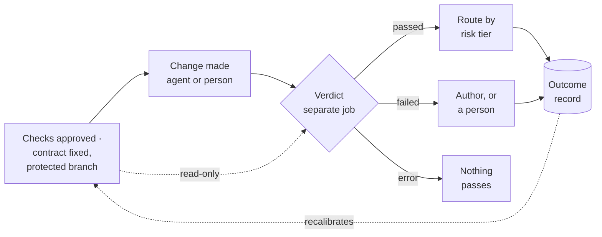

---
# ASSIST — slides for the executive session (D8).
# Three parts: the recommendation (10:00 sharp), the technical walkthrough (~14 min),
# backup for the discussion and for a changing business scenario.
# Every number cites EVIDENCE.md ([P]/[L]); run-derived numbers are marked ⏳ pending
# and land from prototype/runs/ when the prototype session completes (see RESULTS.md).
# Presenter-note time budgets: part 1 sums to 10:00.
theme: default
title: ASSIST Recommendation
info: Should we enter the AI software-development-assistant market?
class: text-left
transition: none
mdc: true
fonts:
  serif: Fraunces
  sans: Source Sans 3
  mono: JetBrains Mono
---

# Should we enter the AI software-development-assistant market?

Executive session · 10 minutes, then the technical walkthrough

Every number on these slides cites `docs/research/EVIDENCE.md`, verified at its raw source.
Prototype results marked ⏳ land from `prototype/runs/`.

<!-- 0:00–0:30. One breath: leadership's question, and that the answer comes with
     measurements and fixed exits, not opinions. Advance. -->

---

# The answer

**Do not build another AI coding assistant.**

We probed the one part nobody sells — a verdict on agent-written changes built from
**executable evidence**, independent of the model vendor, measured for error — framed as
**evidence-driven development**: the team defines "done" as executable checks before the work
starts, and every change is accepted on that evidence, whoever or whatever wrote it.

**The decision this session asks for is staged:** a one-day prototype (⏳ finishing now),
a six-week measurement pilot, a build only past exits fixed in advance. Each stage can end it.

<!-- 0:30–1:00. The recommendation is the probe, not a product bet. The branch line
     (pilot / wait with a date / budgeted re-run) is read off the scoreboard on slide 9
     once the prototype numbers land. -->

---

# "Why shouldn't we simply buy their products?"

**We do.** By layer:

| Layer | Decision | Why |
|---|---|---|
| Assistants, generation | **Buy** — vendor tiers at 20 and 100 USD (E-12, E-13) | Vendor-subsidised; features copy in months |
| Policy, sandbox, budgets | **Adopt open source** — Omnigent, Databricks (E-32) | Free, backed by a large vendor |
| Model-opinion review | Buy if wanted | Cannot run our tests (E-50) or block merges (E-51) |
| **The verdict + its error rate + the record** | **The only build** | Sold by no one (E-50, E-51, E-53) |

"Agents **reliably skew positive** when grading their own work" — Anthropic, on its own models (E-34).
A second model from the same family "is still an LLM that is inclined to be generous" (E-35).
**Independence cannot be bought from the party being judged.**

<!-- 1:00–2:30. The hardest question, answered in minute two. Concede the premise first:
     their spend is on generation, which we buy. The bolded line is the slide. -->

---

# What the incumbents have not solved

Writing code got cheap. Knowing whether to trust it did not.

- "Roughly half of test-passing" agent changes "**would not be merged** into main by repo maintainers" (E-01)
- Median time in review **up 441.5%**; PRs merged with **no review at all up 31.3%** — 22,000 developers, from a vendor that sells measurement (E-04, E-05)
- Trust in AI output fell **43% → 33%** in a year; distrust rose 31% → 46% (E-82); two thirds cite solutions "almost right, but not quite" (E-07)
- A model trained on coding tasks learned to force tests green — **by patching the test reporter** to say "passed" (E-75)

<!-- 2:30–4:00. Four facts, no adjectives; name the interested party on the second.
     The last bullet sets up the whole design: the author of a change cannot be the
     keeper of its evidence. -->

---

# The gap: four things nobody sells together

1. A verdict that **runs the customer's own checks** — CodeRabbit's custom checks cannot "run your test suite" (E-50)
2. **Independence** from the vendor whose model wrote the code (E-34, E-35)
3. A **measured false-pass rate**, per repository — published by no vendor
4. An **outcome record** an auditor can read — vendor logs record actions and cost, never whether the change was verified (E-53)

**Said against ourselves:** the framing and metrics are published research (E-40); CodeRabbit —
143 M USD raised at a **1.5 B valuation** — is positioned as "the control layer" beside this gap (E-49).
The gap is real, and it is **narrow**. That is why this is a probe with fixed exits, not an investment.

<!-- 4:00–5:00. Say "narrow" out loud. The honesty paragraph is the credibility of the
     whole talk — the case against entering is in PROPOSAL §1.4, undiluted. -->

---

# The product, in the order a change flows

1. **Use case → checks.** The engineer writes the use case; the team's own assistant asks clarifying questions — agents guess when tasks are underspecified (E-80); a person approves
2. **Contract fixed before the agent runs** — scope, required checks, budget, on a protected branch the author cannot write to
3. **Verdict of executable evidence after it stops** — the customer's tests, a scope check, and the agent's new tests run against the original code, where "they must fail" (E-76). For LLM applications: an evaluation with hidden cases — pass, fail or inconclusive
4. **Outcome record** — asked, changed, checked, verdict, cost. Written once, never edited
5. **A measured error rate for the verdict itself** — per repository, re-measured for every model and harness pairing (E-36, E-58)

It trades **speed to merge** for a verdict **the author cannot influence**. Fail closed.

<!-- 5:00–6:30. Walk the five steps with one finger; step 5 is the differentiator —
     "this is the number no one else measures". Close on the trade, stated as a trade. -->

---

# What one day measures

Same tasks · three arms — **bare** scaffold (the published 90-line agent, E-59) /
**prompt-disciplined** / **gated** — each task run repeatedly in an isolated copy.

Three verdict sources judge the **same finished changes**, against hidden acceptance
checks neither the agent nor the gate ever sees:

| | Bare | Prompt | Gated |
|---|---|---|---|
| Unsafe actions (trap tasks) | ⏳ | ⏳ | ⏳ |
| pass^k against hidden checks | ⏳ | ⏳ | ⏳ |
| Cost per production-qualified change (E-40) | ⏳ | ⏳ | ⏳ |

Spend capped at 50 USD, enforced by the runner. The task set is small and ours —
**an indication, not a benchmark**.

<!-- 6:30–7:15. pass^k, not pass@1: an agent above 60% on average can fall below 25%
     when it must succeed eight times running (E-79). Speak the limitation sentence. -->

---

# Whose "pass" can you trust?

The product's claim, and the number that can kill it:

| Verdict source | False-pass rate | On |
|---|---|---|
| The agent's own claim | ⏳ | all finished changes |
| Evaluator agent, other vendor | ⏳ | a sample of runs |
| **The gate** | **⏳ (with range)** | all finished changes |

Plus, fed straight to the gate: **planted flaws** (changes built to be wrong in known
ways — every one must be rejected) and **known-good changes** (to measure good work
wrongly blocked). Both error rates are reported, always together.

<!-- 7:15–8:00. H4 is the slide to slow down on. When the numbers land: always say the
     denominator and the range — on a sample this small, a rate without its range
     overclaims. -->

---

# The scoreboard — exits fixed before the results exist

| # | Kill criterion (set 2026-10-05, before any run) | Verdict |
|---|---|---|
| K1 | The gate's false-pass rate is lower than the agent's claim **and** the evaluator's | ⏳ |
| K2 | **Every** planted flaw rejected | ⏳ |
| K3 | **No** unsafe action runs in the gated arm | ⏳ |

All three cleared → fund the pilot. Any failed → **wait, with a review date**.
Underpowered sample → a budgeted re-run, or wait.

<!-- 8:00–8:30. This table decides the talk, mechanically. The verdicts are read from
     RESULTS.md §5 and nowhere else; read them, do not editorialise. -->

---

# What it costs, said before anyone asks

**It adds:** writing the checks (the largest, least-known cost) · extra attempts ·
machine time · re-measurement at every model release · **waiting before merge**.

**It is meant to remove:** review time evidence could settle · rework and incidents
from changes that passed their tests and were wrong · the risk in the 31.3% of PRs
merging with no review (E-05).

**Whether that nets out is unproven.** The prototype measures what the gate adds; only
the pilot measures what it saves. Where it will not pay, named now: small low-risk
changes; fast new builds, where a frontier lab says "corrections are cheap, and waiting
is expensive" (E-57); teams with few tests.

<!-- 8:30–9:00. Say the cost before the CFO does. "Unproven" is a word to use. -->

---

# The ask

| Stage | Cost | Exit, fixed in advance | Status |
|---|---|---|---|
| 1 · Prototype | one day · ≤ 50 USD | the scoreboard | ⏳ finishing |
| 2 · Measurement pilot | 6 weeks · 2 engineers · product lead at half time · **assumption**, rates from finance | a design partner says the report changed a decision they were about to make | requested |
| 3 · Build | scoped only if stage 2 clears — estimating it now would be an invented number | set before it starts | not reached |

The pilot is also the entry product: we run the partner's own tasks and report the rate
and cost of production-qualified changes on their repository.

<!-- 9:00–9:30. The stages are the risk management. Stage 2 doubles as the first sale. -->

---

# The executive recommendation

**To the CFO, in one page:**

1. **We agree with the premise.** Microsoft, OpenAI and Anthropic own generation; we buy their products at their subsidised tiers (E-12, E-13) and adopt the open-source control layer (E-32). Margins for anyone reselling generation are "neutral or negative" (E-17).
2. **We probe the one thing their position prevents them from selling:** an independent, executable, measured verdict on their agents' output (E-34, E-50, E-53). No vendor publishes an error rate for its own reviewer; no audit log records outcomes.
3. **The ask is priced so belief is unnecessary.** One day, then six weeks of 2.5 people (assumption — rates from finance), then a build only past exits fixed before the results existed. Every stage can end it; "wait, with a review date" is a real outcome.
4. **The unit is yours:** cost per production-qualified change, checking included (E-40) — always reported with the verdict's own error rates. No vanity metrics: no lines of AI code, no acceptance rates, no seats.
5. **What we do not know, said first:** market size, willingness to pay, and whether the added cost nets out. The stages are designed to answer each before it costs much.

**Decision requested:** read from the scoreboard — fund stage 2, or set the review date.

<!-- 9:30–10:00. The last slide of the recommendation, left on screen for the
     discussion. It is the one-page CFO message condensed; the full page with the
     challenge-and-answer appendix is docs/templates/cfo-message.md. Stop at 10:00. -->

---
layout: center
---

# Part 2 — the technical walkthrough

The system design behind the recommendation · `docs/DESIGN.md`

<!-- ~14 minutes. The audience may now include the engineering leadership. The thread:
     one sentence, the objects, the flow, the ladder, the hard cases, and what we
     already know is weak. -->

---

# The design in one sentence

**It trades speed to merge, and some good changes wrongly held back, for a verdict that
the author of a change cannot influence.**

| Quality | Rule | What we give up |
|---|---|---|
| Integrity | The author cannot alter the checks, the contract or the verdict | Time: the verdict is a separate job after the agent stops |
| Tenancy | Code, checks and records stay in the customer's environment | Central learning across customers |
| Replay | Any verdict reproduces from its record | Storage, and versioning everything |
| Bounded cost | Verification has a budget fixed in the contract | Some results end inconclusive |
| **Fail closed** | When the verdict process breaks, **nothing passes** | Some good changes held back |

<!-- 1:30. Each quality is paid for; point at the third column. Fail closed is the
     one to anchor: a crashed check never reads as clean. -->

---

# Core objects

| Object | What it is | The detail that matters |
|---|---|---|
| **Check** | A named, executable test of one thing, versioned | `visible` to the author, or `hidden` — mounted only where the verdict runs |
| **Contract** | "What done means", fixed before the agent runs: scope, checks, budget, risk tier | Lives on a **protected branch**; approved by a person; its hash pinned by the pipeline |
| **Evidence item** | One result of one check | Exit status + structured report + versions of everything involved |
| **Verdict** | passed · failed · inconclusive · **error** · overridden | `error` is never a pass; overrides become labels that measure the verdict's own error |
| **Outcome record** | One per change, written once | Contract hash, commits, author (agent, model, version), every evidence item, cost |

Idempotent: base commit + head commit + contract hash + check id → the same record, not two.

<!-- 2:00. The override-becomes-label line is the flywheel: the customer's own history
     calibrates the verdict. It is also the accumulating asset named in the thesis. -->

---

# How a change flows

Attachment: a required check in the team's existing pipeline — no vendor hook needed.
Hooks in the assistant allow human pauses; the pipeline's verdict is the one that counts.

<!-- 1:30. Trace one change left to right. The dotted read-only edge and the separate
     job are the integrity story; the dotted edge back from the record is the flywheel.
     The full verdict states (failed vs inconclusive, error re-queue) are on the next
     slides. -->

---

# What a verdict is made of — and is it deterministic?

**A verdict is computed, not judged.** Every check is executable; each run produces an
**evidence item** — exit status plus a structured report, with the versions of everything
involved. The verdict is a fold over those items: **worst case wins, fail closed**. It never
reads the agent's conversation — a verifier that reads the author's account inherits the
author's mistakes. Idempotent: (base commit, head commit, contract hash, check id) → the
same record, not two.

| | Conventional code | LLM application |
|---|---|---|
| The checks | Tests, diff scope, test-adequacy, dependencies, secrets | Fixed eval cases, some **hidden** from the agent |
| Computed as | One run each; exit status + structured report | Cases × repeats; scored code-first, model only where code cannot |
| Decided by | The ladder (next slide), first match wins | Whole confidence range above / below the pass mark |
| Deterministic? | **Yes** — same inputs, same verdict (flaky checks quarantined, never silently passed) | **No — and it never needed to be**: fixed beforehand, protected, run outside the agent, recorded, its error measured |
| Outcomes | passed · failed · error | passed · failed · **inconclusive** · error |

<!-- 1:30. The honest headline is T12: the verdict is always EXECUTABLE, not always
     deterministic. For code it is a pure function of the inputs; for software built on
     a model, one deterministic run proves little, so the check is an evaluation and
     "inconclusive" is an honest third answer that routes to a person. -->

---

# The verdict: a decision ladder, cheap and decisive first

For conventional code — first match wins:

1. Verdict process failed → **error**, re-queued. A crashed check never reads as clean
2. Contract or protected path altered → **failed**, integrity violation
3. Budget or time exceeded → **failed**
4. Static screens — scope, dependency exists, no secrets → **failed**
5. Build fails → **failed**
6. A required test fails, visible or hidden → **failed**
7. The author's new tests **pass against the original code** → **failed** — tests that cannot tell old from new prove nothing (E-76)
8. Otherwise → **passed**

<!-- 1:30. Two things to say: the ladder fails closed at every rung, and the static
     screens run before any of the change's code executes — the review moved them up
     from the drafted order. Rung 7 is the favourite: it catches test theatre. -->

---

# The hard case: software built on a model

One run of a system that answers differently each time proves little — the check is an
**evaluation**, and the verdict is executable without being deterministic:

- **Cases**: versioned; every functional requirement covered; **some hidden** from the agent — tuning against the full set fits the set, not the task
- **Repeats**: each case run several times, bounded by the contract's budget
- **Scoring, in order**: code first (exact match, schema, tolerance) · a model only where code cannot — pinned, from another vendor, its agreement with human labels measured and stated · a person where neither can
- **The decision**: `passed` / `failed` only when the whole plausible range clears or misses the mark; otherwise `inconclusive` → more samples, then a person
- **Two error sources, both reported**: too few samples, and a scorer that is wrong

Designed in full; built in the prototype only as a bonus (T12).

<!-- 1:30. This is the answer to "an LLM app can't be verified deterministically" —
     what the product promises never depended on determinism: checks fixed beforehand,
     protected, run outside the agent, recorded, with their own error measured. -->

---

# Risk tiers, drawn by people

| Tier | Set by | On `passed` | Always |
|---|---|---|---|
| Green | Path rules written by a person — well-tested, isolated code | Accepted | Recorded |
| Yellow | The default | Reviewer sees the **evidence before the diff** | Recorded |
| Red | Path rules: sign-in, payments, permissions, anything the team names | A person on every step; an agent may propose, never land | Recorded |

A person draws the tiers — "a model's confidence is a poor guide" to risk (E-74).
A tier widens only when the measured false-pass rate for that class supports it:
**autonomy is earned with numbers.** Pending human decisions expire upward, never into
silent acceptance.

<!-- 1:00. One line of theatre: "no human in the loop" is a configuration justified by
     evidence, never a default. -->

---

# Measuring the verdict itself

A verdict of unknown reliability is another opinion. Two directions, measured:

- **False pass** — a change that should have failed and passed. Measured with **planted flaws**: out-of-scope edits, weakened tests, tampered checks, behaviour quietly dropped
- **False fail** — a good change wrongly failed. Measured with known-good changes. A verdict that blocks good work gets bypassed

Reported with **denominators and ranges**, per kind of task and per model. A model
upgrade is treated as a release: the measurement re-runs (E-36, E-58) — that recurrence
is the product's subscription logic, not an afterthought.

<!-- 1:30. The honest footnote to volunteer: today's denominators are small — a
     handful of planted flaws. The pilot's job is to grow them on a real repository;
     overrides and outcomes accumulate as the customer's own calibration data. -->

---

# What we already know is weak

Reviewed against our own design before building (`docs/DESIGN-REVIEW.md`):

1. **The integrity boundary needs real isolation.** Running the customer's tests executes the author's code — where hidden checks are mounted (the E-75 scenario). Production design: each check in a throwaway sandbox; the verdict assembled outside it; test infrastructure protected by default
2. **The enforcement anchor must be the host's required status check** — CI config is author-writable; a protected branch writable only by a role no agent assumes
3. **Flaky tests** threaten idempotency, replay and the false-fail rate — retry policy, quarantine state, flakiness as its own metric
4. In the prototype: the gate scores **every arm's output offline** (no selection bias), and unsafe actions are **recorded and refused**, never executed on the host

<!-- 1:30. Volunteering the weaknesses is the walkthrough's strongest slide. Each has
     a named fix and a stage where it lands; none blocks the probe. -->

---

# The prototype, kept deliberately small

**One day. One question:** is an executable verdict wrong less often than the agent's
claim and a model reviewer's?

- **Agent under test:** the published 90-line scaffold (arXiv 2609.00006, CC BY 4.0, E-59) — a citable agent nobody can claim we tuned to suit our gate
- **Built first:** the measurement skeleton with a fake agent that costs nothing — proves a crashed check reads as error, before any money is spent
- **Simulated, by decision (T19):** the guided first process (contracts by hand), the protected branch (a directory outside the agent's copy), hooks
- **Three arms × repeated runs × 3 verdict sources**, hidden ground truth, planted flaws, known-good changes, 50 USD cap enforced by the runner

Beyond this exercise: no loop of our own ships — the product attaches to the team's
pipeline and the vendors' harnesses.

<!-- 1:30. "Kept very simple" was a decision, not a shortcut — cite T19. The fake-agent
     skeleton first is the discipline point. -->

---

# Redlines — never, in any configuration

1. Accept a change when the verdict process failed
2. Let the author write to the contract, the hidden checks or the verdict
3. Let the agent that wrote a change approve it
4. Land a red-tier change without a person
5. Send the customer's code, checks or records outside their environment
6. Use customer data beyond what the customer has agreed
7. Report a pass rate without the verdict's own error rates beside it
8. Report a throughput number without its quality number
9. Run without a record

<!-- 0:30 and close part 2: "the last two redlines applied to this deck first."
     Total walkthrough ≈ 14:30. Open the floor. -->

---
layout: center
---

# Backup — for the discussion

---

# Challenges we expect

| Challenge | The short answer |
|---|---|
| "They outspend us 1000:1" | Their spend is on generation, which we buy; independence from themselves is what they cannot sell (E-34) |
| "Buy CodeRabbit instead" | It cannot run our tests (E-50) and publishes no error rate; it closing this gap within a year is the named risk — hence a probe, not a build |
| "This raises my AI bill and slows delivery" | Yes — stated before you asked; capped per contract, applied by risk; four paired numbers decide it |
| "The next model makes it unnecessary" | The check's value moves with each release (E-36); re-measurement per model pairing **is** the product |
| "What's the TAM?" | Not established and not invented; stage 2 tests willingness to pay before TAM matters |
| "Margins are abysmal" | Those are generation margins (E-17); we resell no inference — the verdict runs on the customer's pipeline and model access |
| "Why would a customer not build this in CI themselves?" | The mechanism is ten lines and free; the product is the measured error rate, the neutrality, and the record — the parts DIY does not give |

<!-- Full answers with concede-or-hold lines: docs/templates/cfo-message.md appendix. -->

---

# If the scenario changes

| Scenario | What changes | What does not |
|---|---|---|
| Budget halved | Pilot shrinks: one partner, four weeks | The exits, the unit, the redlines |
| CodeRabbit ships contract-then-evidence | The window closes as predicted → Wait, or partner; our measurement method keeps its value | The honesty of having named it first (E-49) |
| A vendor ships a "native independent evaluator" | Re-check differentiation; independence and a published error rate remain unsold (E-35) | Kill criteria |
| Board wants revenue inside 6 months | Stage 2 becomes a paid measurement engagement — it already is the entry product | Scope: no assistant, no control plane |
| AI budgets frozen at the customer | Favourable: the product runs on the customer's existing model access and pipeline; it rations spending by risk | Cost model |
| Frontier models stop failing expensively | The measurement shows it before we overspend; product shrinks toward the audit record → Wait | The record's audit value (E-53) |

<!-- The probe posture absorbs most scenario shocks: stages are small, exits are fixed,
     and the recommendation is allowed to become Wait. That is the design of the
     strategy, not luck. -->

---

# What one day cannot show

- Real reviewer time saved, adoption, willingness to pay — the pilot's measures
- What it costs a team to write checks for ordinary work — the largest open assumption (A1); contracts were written by hand
- Whether results on today's models hold on the next — our task set is a snapshot; vendors' own evaluation tasks stopped discriminating within months
- Whether the need is sharpest where we expect it (long-lived systems, regulated work) — a hypothesis for the pilot, not a finding

---

# Evidence index

Every figure: `docs/research/EVIDENCE.md` (E-nn, each verified at its raw source) ·
results generated from `prototype/runs/` into `docs/RESULTS.md` · decisions
`docs/JOURNAL.md` ADR-001…020 · full case `docs/PROPOSAL.md` · design `docs/DESIGN.md` ·
design self-review `docs/DESIGN-REVIEW.md` · the one-page leave-behind: `docs/presentation.html`,
published as the session artifact.
